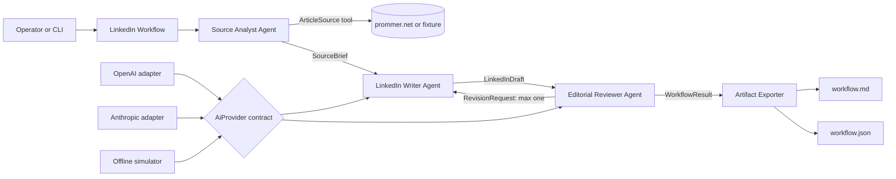
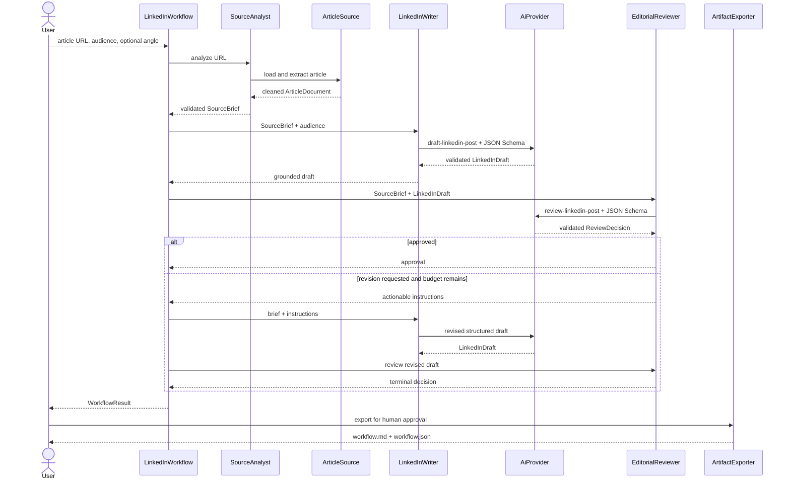
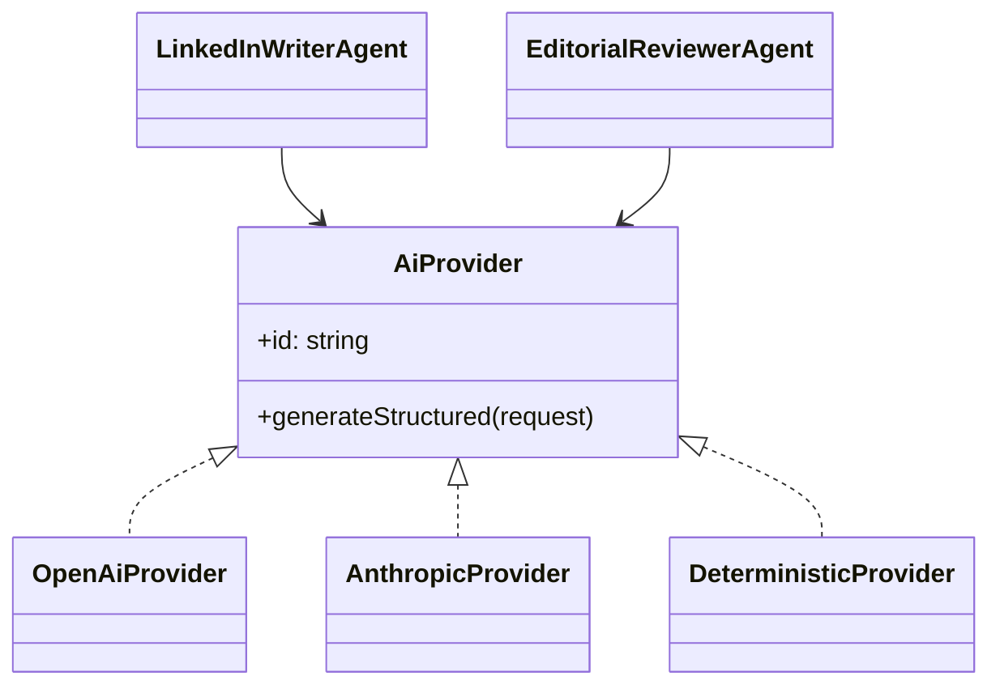

# Prommer LinkedIn Content Workflow

A modular, provider-neutral workflow turns a prommer.net article into a grounded LinkedIn draft, validates it with an independent editorial agent, allows one controlled revision, and exports reviewable Markdown and JSON artifacts.

This is a minimum end-to-end POC. It intentionally stops at a human approval boundary; it does **not** post to LinkedIn or require credentials for the included demo.

## Try it in two minutes

Prerequisites: Node.js 22 or newer and npm.

```bash
npm install
npm test
npm run demo
```

The demo runs entirely offline against a local article fixture. Inspect the generated [Markdown artifact](artifacts/demo/workflow.md) or [JSON trace](artifacts/demo/workflow.json).

To process a live public article with a model provider:

```bash
cp .env.example .env
# Export the same values in your shell, or load .env with your preferred tool.
AI_PROVIDER=openai OPENAI_API_KEY=... OPENAI_MODEL=... \
  npm exec tsx src/cli.ts -- \
  --url https://prommer.net/en/tech/ai-is-the-new-os/ \
  --audience "founders and AI-native operators" \
  --out artifacts/latest
```

Use `AI_PROVIDER=anthropic`, `ANTHROPIC_API_KEY`, and `ANTHROPIC_MODEL` for Claude. Model names are required configuration rather than hard-coded defaults, so changing available models does not require an application release.

## Architecture

The application layer depends on ports, never provider SDKs or filesystem details. Zod contracts validate every agent handoff at runtime as well as at compile time.



The three responsibilities remain distinct:

| Step               | Trigger                                     | Tool or agent                     | Input                                    | Validated output                             | Next handoff                               |
| ------------------ | ------------------------------------------- | --------------------------------- | ---------------------------------------- | -------------------------------------------- | ------------------------------------------ |
| 1. Source analysis | Operator supplies an article URL or fixture | Source Analyst + `ArticleSource`  | HTML article                             | `SourceBrief` with evidence-backed claim IDs | Writer receives the brief, not raw HTML    |
| 2. Draft           | Brief is ready                              | LinkedIn Writer + `AiProvider`    | Brief, audience, optional angle/feedback | `LinkedInDraft`                              | Reviewer receives draft and original brief |
| 3. Review          | Draft is ready                              | Editorial Reviewer + `AiProvider` | Brief + draft                            | `ReviewDecision`                             | Approves or returns actionable feedback    |
| 4. Revision        | Reviewer rejects and budget remains         | Writer + same provider contract   | Original brief + review instructions     | Revised `LinkedInDraft`                      | Reviewer checks it once more               |
| 5. Export          | Review terminates                           | Filesystem Artifact Exporter      | Full normalized workflow result          | Markdown + JSON                              | Human decides whether to publish           |

## Runtime handoffs



## Provider contract

Both AI-backed agents use this application-owned interface:

```ts
interface AiProvider {
  readonly id: string;

  generateStructured<T>(
    request: StructuredGenerationRequest<T>,
  ): Promise<AiProviderResult<T>>;
}
```

Each request carries provider-neutral instructions, input, a JSON Schema, and a runtime parser. Each adapter maps its wire response back to the same validated result or a stable `ProviderError` category.



The OpenAI adapter targets the [Responses API structured-output format](https://developers.openai.com/api/reference/cli/resources/responses/methods/create), disables response storage with `store: false`, and extracts `output_text`. The Anthropic adapter targets the [Messages API](https://platform.claude.com/docs/en/api/messages/create) and its JSON Schema `output_config.format`. HTTP transports are injected in tests; no test makes a live provider request.

### Add another provider

1. Implement `AiProvider` in `src/infrastructure/providers`.
2. Translate `StructuredGenerationRequest` to the vendor request.
3. Parse the vendor response with `request.output.parse`.
4. Normalize authentication, rate-limit, timeout, availability, and malformed-output errors to `ProviderError`.
5. Add mocked protocol tests and one factory branch.

No agent or workflow change is needed.

## TDD evidence

The implementation was driven from observable contracts outward. The first contract test failed because incomplete handoffs were accepted; the schemas then made it pass. The next test set was added before the application modules and failed at the missing behavioral boundaries. The current suite contains 17 offline tests covering:

- valid and invalid runtime handoffs;
- HTML content extraction and exclusion of navigation/footer noise;
- isolated source, writer, and reviewer behavior;
- first-pass approval, rejection/revision/approval, and retry exhaustion;
- OpenAI and Anthropic request mapping with mocked `fetch`;
- normalized errors without credential leakage;
- Markdown/JSON export; and
- a full credential-free CLI execution.

Run all delivery checks with:

```bash
npm run check
npm run build
```

## Safety and operating decisions

- Article HTML is untrusted. It is deterministically reduced to a `SourceBrief`; the writer never receives raw HTML, and its prompt explicitly rejects embedded instructions.
- Generated drafts must retain the canonical URL and may reference only known claim IDs. These checks run in code after model output validation.
- The orchestrator owns termination. A reviewer can request only one revision by default; persistent rejection becomes `needs-human-review`.
- Provider keys remain at the composition boundary. Prompts, headers, raw responses, and keys are not written to artifacts.
- “Publish” in this POC means local artifact export. LinkedIn OAuth, posting, scheduling, and analytics are deliberately outside scope and require a separate consequential-action design.

## Project structure

```text
src/domain                 Runtime schemas and normalized errors
src/application/ports      Provider and article-source interfaces
src/application/agents     Source, writer, and reviewer responsibilities
src/application/workflow   Explicit orchestration and retry policy
src/infrastructure/article HTTP, fixture, and HTML extraction adapters
src/infrastructure/providers OpenAI, Anthropic, and offline adapters
src/infrastructure/publishing Markdown/JSON artifact exporter
src/prompts                Versioned agent instructions
tests                      Offline unit, adapter, workflow, and CLI tests
artifacts/demo             Reproducible sample output
```

## Current limitations

The HTML extractor intentionally uses simple semantic selectors rather than a general web crawler. Live provider adapters are protocol-tested but are not exercised by CI because they require paid credentials. The offline provider is a deterministic workflow simulator, not an AI quality benchmark. Before production use, add observability, request budgets, provider retries/backoff, content moderation, persistent approvals, and a dedicated authenticated LinkedIn adapter.
